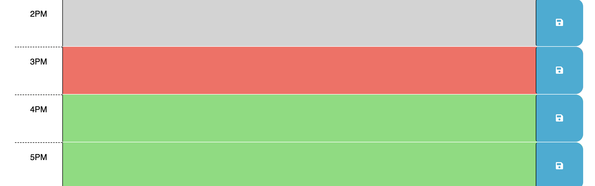

# Work Day Scheduler Starter Code

# Description
This exercise allowed for me to attempt to fix the javascript logic behind this daily planner. The challenge was in converting my understanding of DOM manipulation from vanilla javasript into Jquery. Aside from building this application the value in fixing this project was for me to exercise and familiarise myself with the syntax of new API's such as jquery and bootstrap, which when understood are incredibly powerful tools. 

# Usage
Link to Github Pages daily organiser: https://nikoauer.github.io/Daily-Planner/

# Credit and Resoures

Below is a list of resources used to help solve the issues of the site:
- https://stackoverflow.com/questions/40791207/setting-and-getting-localstorage-with-jquery
- https://sentry.io/answers/save-arrays-objects-browser-storage/
- https://www.youtube.com/watch?v=Bzdtt0zh2fI
- https://api.jquery.com/jquery.parsejson/
- https://www.geeksforgeeks.org/how-to-hide-div-element-after-few-seconds-in-jquery/
- https://www.w3schools.com/jquery/jquery_hide_show.asp
- https://api.jquery.com/category/manipulation/
- https://stackoverflow.com/questions/59995703/trying-to-change-background-color-based-off-if-the-hour-is-in-the-past-current